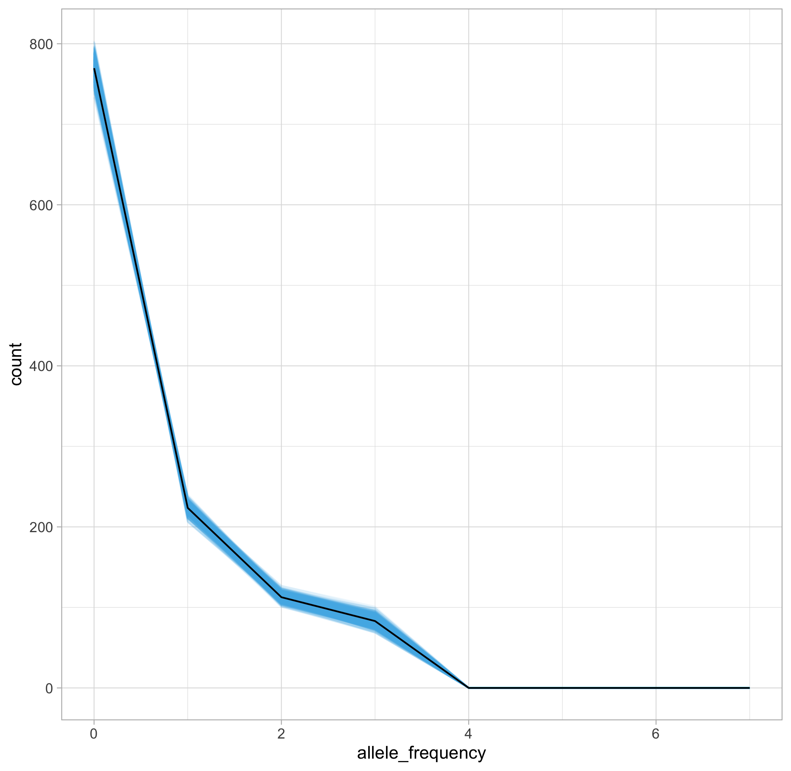
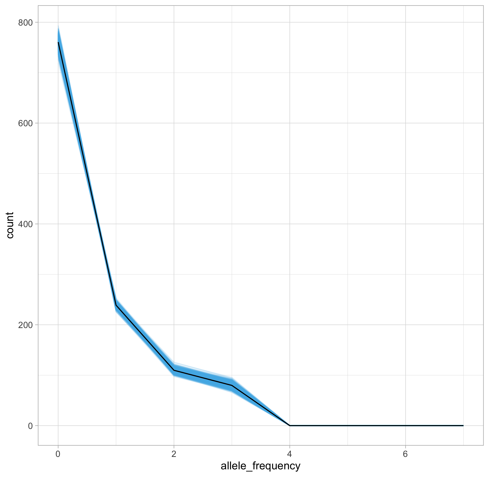

# Note
This script is a fork modified from the 
[original](https://github.com/isaacovercast/easySFS). 
The modified script implements the option of 
bootstrap resampling. 
Output data can be used for calculating non-parametric bootstrap confidence intervals.

## New options
```
-b BOOTSTRAP        Perform bootstrap resampling. Specify # of samples.
-s SEED             Seed for bootstrap resampling.
-k BLOCK_SIZE       Block size (# SNPs) for bootstrap resampling.
-t THREADS          # of threads for parallel bootstrapping.
```

## Output
Output files of bootstrap samples are written to /output/bootrep#, 
while those of original data are to /output/original.

## Example
```
./easySFS.py -i example_files/wcs_1200.vcf -p example_files/wcs_pops.txt -a --proj=7,7 -b 1000 -s 123 -k 10 -t -1
```
This provides 1000 bootstrap samples with block size of 10 SNPs. 
If ```-t``` option is specified, resampling is performed in parallel using 
[Joblib](https://joblib.readthedocs.io/en/latest/) package.

#### pop0 SFS
```
                0	1	2	3	4	5	6	7
original	769.7	223.6	112.7	83.1	0	0	0	0
bootstrap mean	769.3	223.8	112.8	83.1	0	0	0	0
bootstrap sd	12.0	5.4	4.5	5.6	0	0	0	0
```


#### pop1 SFS
```
                0	1	2	3	4	5	6	7
original	760.7	238.8	109.7	79.8	0	0	0	0
bootstrap mean	760.6	238.8	109.8	79.8	0	0	0	0
bootstrap sd	11.7	4.7	4.6	5.3	0	0	0	0
```


Other usage is same with the original.  
<br>
<br>
2020-05-18  
ITO Tsuyoshi

---
# easySFS
TL;DR - easySFS is a tool for the effective selection of population size projection for construction of the site frequency spectrum. It may be used to convert VCF to dadi/fastsimcoal/momi2 style SFS for demographic analysis.

## Why is this needed?
The site frequency spectrum can not be constructed in a coherent fashion on a data matrix with missing values. Missing data is a prominent feature of RADSeq-like datasets and simply removing sites with missingness would drastically throw out the majority of your data. One could also impute missing values, some people do this, but if you have lots of missing data the imputation will be unreliable. The down projection method is a sort of compromise between these two extremes. You "project down" to a smaller sample size and "average over" all possible resamplings to construct a complete data matrix. To be clear, I didn't invent this down projection strategy, I believe Marth et al 2004 get the credit here, I just made this python program for automating exploration of the projection values.

## Choosing projection values
In terms of how to choose projection values Gutenkunst et al 2009 provide a heuristic mechanism, suggesting that maximizing the number of segregating sites is the best strategy. Whether this is true or not is an open question at this point, but it's the best we've got, and it's what most people do, if they are being careful. EasySFS simply counts the number of segregating sites per projection value for each population. Then you may choose the projection value based on the results it displays.

## A note on input VCF file format
This is a relatively simple script. It was created for use with VCF files from RAD-style datasets. VCF file formats differ pretty dramatically so ymmv. Right now it's been tested and seems to run fine for VCF as output by both pyrad/ipyrad and tassel. 

# Installation and operation

## Dependencies
The script assumes you have matplotlib and dadi installed.

## Install & Run
* Install [miniconda for python3](https://docs.conda.io/en/latest/miniconda.html)
* Create and activate a new environment: `conda create -n easySFS` & `conda activate easySFS`
* Install dependencies: `conda install -c bioconda dadi pandas`
* Clone this repo
 * `git clone https://github.com/isaacovercast/easySFS.git`
* `cd easySFS`
* `chmod 777 easySFS.py`
* `./easySFS.py`

## General workflow
Converting VCF to SFS is a 2 step process. The first step is to run a preview to identify the values for projecting down each population. The second step is to actually do the conversion specifying the projection values. It looks like this:

`./easySFS -i input.vcf -p pops_file.txt --preview`

Which will output something like this:
```
Pop1
(2, 45.0)   (3, 59.0)   (4, 58.0)   (5, 49.0)   (6, 41.0)   (7, 35.0)   (8, 27.0)   (9, 20.0)   (10, 13.0)  (11, 8.0)   (12, 8.0)   (13, 5.0)   (14, 2.0)   (15, 2.0)   (16, 1.0)   

pop2
(2, 68.0)   (3, 96.0)   (4, 106.0)  (5, 110.0)  (6, 108.0)  (7, 89.0)   (8, 76.0)   (9, 66.0)   (10, 56.0)  (11, 49.0)  (12, 42.0)  (13, 39.0)  (14, 34.0)  (15, 29.0)  (16, 27.0)  (17, 26.0)  (18, 24.0)  (19, 23.0)  (20, 21.0)  (21, 22.0)  (22, 20.0)  (23, 19.0)  (24, 16.0)  (25, 16.0)  (26, 15.0)  (27, 15.0)  (28, 13.0)  (29, 13.0)  (30, 14.0)  (31, 14.0)  (32, 14.0)  (33, 13.0)  (34, 12.0)  (35, 9.0)   (36, 9.0)   (37, 8.0)   (38, 8.0)   (39, 8.0)   (40, 6.0)   (41, 6.0)   (42, 6.0)   (43, 5.0)   (44, 5.0)   (45, 5.0)   (46, 4.0)   (47, 4.0)   (48, 4.0)   (49, 3.0)   (50, 3.0)   (51, 3.0)   (52, 3.0)   (53, 3.0)   (54, 3.0)   (55, 2.0)   (56, 2.0)   (57, 2.0)   (58, 2.0)   (59, 2.0)   (60, 2.0)   (61, 2.0)   (62, 0.0)   (63, 0.0)   (64, 0.0)   (65, 0.0)   (66, 0.0)   (67, 0.0)   (68, 0.0)   (69, 0.0)   (70, 0.0)   (71, 0.0)   (72, 0.0)   (73, 0.0)   (74, 0.0)   (75, 0.0)   (76, 0.0)
```
Each column is the number of samples in the projection and the number of segregating sites at that projection value.
The dadi manual recommends maximizing the number of segregating sites, but at the same time if you have lots of missing data then you might have to balance # of segregating sites against # of samples to avoid downsampling too far.

Next run the script with the values for projecting for each population, like this:

`./easySFS -i input.vcf -p pops_file.txt --proj 12,20`

## Input files
Two input files are required, the VCF and the population specification file. VCF in the format as written out by pyrad/ipyrad is known to work well, other vcf formats may work too, but aren't guaranteed. The population assignment file is a plain text file with two columns, one for sample names and one for the population the sample belongs to, like this:

```
sample1 pop1
sample2 pop1
sample3 pop2
sample4 pop2
```

Only samples that are in both the pop file and the vcf file will be included in the final sfs.
## Outputs
By default the script generates all 1D sfs per population, all pairwise joint sfs per population pair and one multiSFS for all populations. If you specify the `-o` flag you can pass in an output directory which will be created, otherwise output files are written to the default directory `output`. There will be two directories created here `dadi` and `fastsimcoal2`.

### dadi
1D SFS will be named like this: `Pop1-<sample_size>.sfs`<br>
Joint SFS will be named like this: `Pop1-Pop2.sfs Pop2-Pop3.sfs`<br>
multiSFS will will be named like this: `Pop1-Pop2-Pop3.sfs`

### Fastsimcoal2
Fastsimcoal2 is pickier about file naming conventions and file format.

1D SFS will be named like this: `Pop1_MAFpop0.obs Pop2_MAFpop0.obs`<br>
Joint SFS will be named like this: `prefix_jointMAFpop0_1.obs prefix_jointMAFpop0_2.obs prefix_jointMAFpop1_2.obs`<br>
multiSFS will will be named like this: `prefix_MSFS.obs`

## Running example files
The example files are different enough where they will give you an idea of what most of the command line options do.

### Diploid example
* Diploid data
* 2 populations
* SFS includes all snps from w/in each locus

Preview: `./easySFS.py -i example_files/wcs_1200.vcf -p example_files/wcs_pops.txt --preview -a`<br>
Convert: `./easySFS.py -i example_files/wcs_1200.vcf -p example_files/wcs_pops.txt -a --proj=7,7`

The `-a` flag specifies that all snps in the vcf should be used. Also, notice the `--ploidy` 
flag is not required since diploid is the default.

### Haploid example
* Haploid data
* 3 populations
* SFS only includes one snp per RAD locus

Preview: `./easySFS.py -i example_files/leuco_1200.vcf -p example_files/leuco_pops.txt --ploidy 1`<br>
Convert: `./easySFS.py -i example_files/leuco_1200.vcf -p example_files/leuco_pops.txt --ploidy 1 --proj=8,10`

Here the `--polidy` flag is required. In this example only one snp per locus
will be randomly sampled for inclusion in the output sfs.

## Usage
You can get usage info any time by: `./easySFS.py`
```
usage: easySFS.py [-h] [-a] -i VCF_NAME -p POPULATIONS [--proj PROJECTIONS]
                  [--preview] [-o OUTDIR] [--ploidy PLOIDY] [--prefix PREFIX]
                  [--unfolded] [--dtype DTYPE] [--GQ GQUAL] [-f] [-v]

optional arguments:
  -h, --help          show this help message and exit
  -a                  Keep all snps within each RAD locus (ie. do _not_
                      randomly sample 1 snp per locus).
  -i VCF_NAME         name of the VCF input file being converted
  -p POPULATIONS      Input file containing population assignments per
                      individual
  --proj PROJECTIONS  List of values for projecting populations down to
                      different sample sizes
  --preview           Preview the number of segragating sites per population
                      for different projection values.
  -o OUTDIR           Directory to write output SFS to
  --ploidy PLOIDY     Specify ploidy. Default is 2. Only other option is 1 for
                      haploid.
  --prefix PREFIX     Prefix for all output SFS files names.
  --unfolded          Generate unfolded SFS. This assumes that your vcf file
                      is accurately polarized.
  --dtype DTYPE       Data type for use in output sfs. Options are `int` and
                      `float`. Default is `float`.
  --GQ GQUAL          minimum genotype quality tolerated
  -f                  Force overwriting directories and existing files.
  -v                  Set verbosity. Dump tons of info to the screen
```

## License
[](https://creativecommons.org/licenses/by/4.0/)

## Credits
`easySFS` is kind of a loose wrapper around `dadi`, which I use for internal sfs representation, and much of the grunt work.
